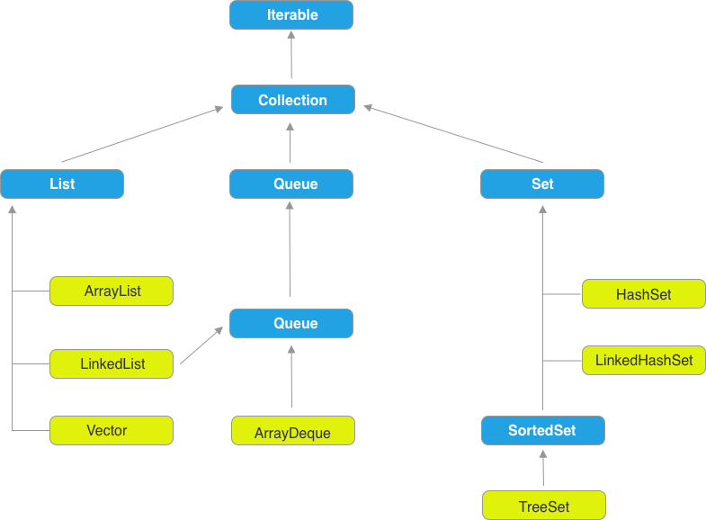

集合是我们平常用的最多的数据类型了，并且自带很多常用方法，比如 sort 等，

## Collection

Collection 接口是 Java 集合体系的根，可以说所有的集合都实现了这个接口。 Collection 扩展/继承了 Iterable 接口， 而 Iterable 就是 Java 中经典的 Iterator 模式。

Collection 下面分为三个大的部分，List， Queue 和 Set。 总体结构图如下所示：

## List

看 JDK 源码， List 开头注释写了：

  An ordered collection, xxxx has precise control over where each element is inserted. xxx, can access by there integer index.

什么意思？ 一个有序的集合，可以精确控制元素插入到集合中的位置，可以通过在元素在集合中的坐标来访问。

### ArrayList

ArrayList， 实际上比较像是一个可以动态扩展的数组。 

### LinkedList

